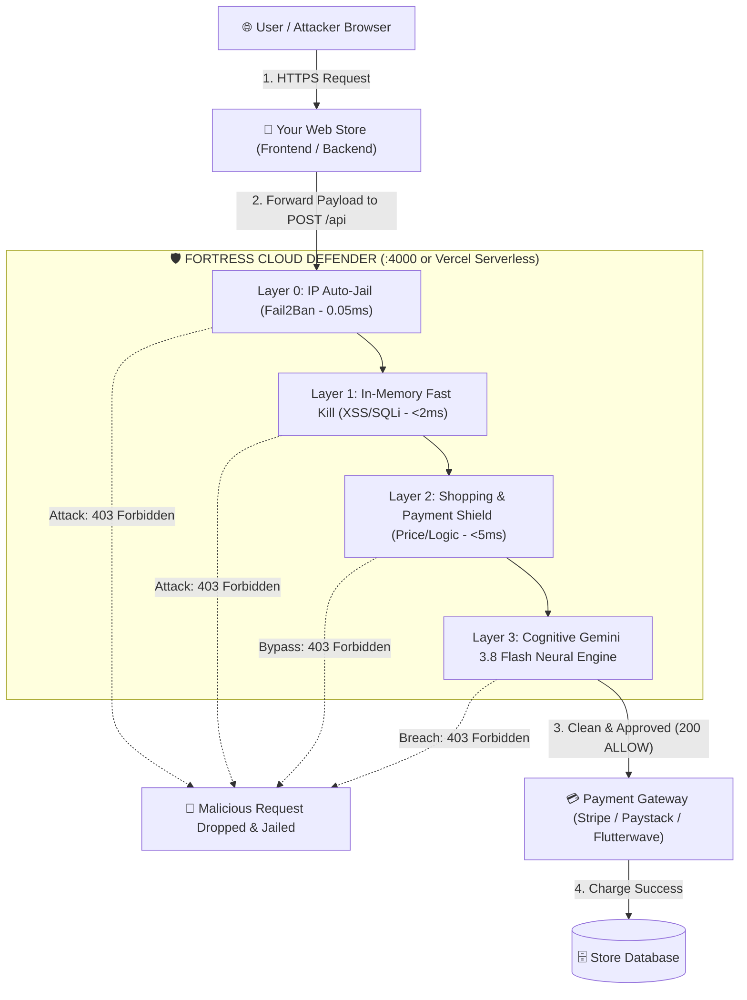
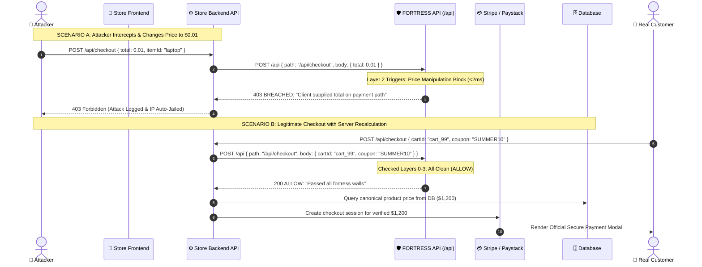
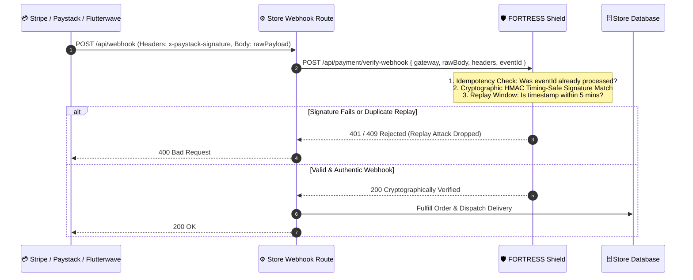

# 🛡️ FORTRESS CLOUD DEFENDER v3.5 (Enterprise Edition)

An always-active, military-grade **API Defense Firewall (WAF)** and **Deep AI Vulnerability Scanner** powered by **Google Gemini 3.8 Flash** and a sub-2ms in-memory pattern shield.

---

## 📐 Diagrammatic Architecture & Web Store Flow

### 1. High-Level System Architecture



---

### 2. E-Commerce Checkout Sequence (Attack vs. Legitimate Flow)



---

### 3. Payment Webhook Security Sequence (Replay & Fraud Prevention)



---

## 🛒 Step-by-Step Web Store Implementation Guide

Integrating FORTRESS into your online store (Node.js, Express, Next.js, or Fastify) takes **under 5 minutes**.

### Step 1: Install or Point to your Deployed FORTRESS API

If you deployed FORTRESS on Vercel, set your endpoint URL:
```env
FORTRESS_API_URL=https://your-fortress-app.vercel.app/api
```
*(Or `http://localhost:4000/api` during local development)*

---

### Step 2: Add the Store Defense Middleware (`fortressGuard.js`)

Create this lightweight middleware in your store backend:

```javascript
// middleware/fortressGuard.js
export function fortressGuard(options = {}) {
  const fortressUrl = process.env.FORTRESS_API_URL || "https://your-fortress-app.vercel.app/api";

  return async (req, res, next) => {
    try {
      // Forward incoming request parameters to FORTRESS Master API
      const response = await fetch(fortressUrl, {
        method: "POST",
        headers: {
          "Content-Type": "application/json",
          "x-forwarded-for": req.headers["x-forwarded-for"] || req.socket.remoteAddress,
          "user-agent": req.headers["user-agent"] || "",
        },
        body: JSON.stringify({
          path: req.originalUrl || req.url,
          method: req.method,
          headers: req.headers,
          body: req.body,
          deepAi: options.deepAi || false,
        }),
      });

      const audit = await response.json();

      // If attack detected, block immediately before it touches your database
      if (audit.fortress_status === "BREACHED" || audit.action === "BLOCK" || audit.action === "BAN_IP_24H") {
        console.warn(`🚨 [FORTRESS SHIELD BLOCKED] ${req.ip} | ${audit.wall_failed} | Reason: ${audit.reason}`);
        return res.status(403).json({
          error: "Access Denied by Security Shield",
          reason: audit.reason,
          code: audit.wall_failed,
        });
      }

      // Store classification attached to request (e.g. E_COMMERCE_SHOPPING)
      req.siteContext = audit.site_classification;
      next();
    } catch (err) {
      console.error("Fortress Shield Offline Warning (Fail-Open/Fail-Closed):", err.message);
      // Depending on policy: next() or return res.status(500)
      next();
    }
  };
}
```

---

### Step 3: Protect Checkout & Cart Routes in Express

```javascript
import express from "express";
import { fortressGuard } from "./middleware/fortressGuard.js";

const app = express();
app.use(express.json());

// Protect all /checkout, /cart, and /order routes with FORTRESS
app.post("/api/checkout", fortressGuard({ deepAi: false }), async (req, res) => {
  const { cartItems, couponCode } = req.body;

  // FORTRESS has already verified:
  // 1. No price tampering in payload
  // 2. No negative / float quantities
  // 3. No coupon stacking abuse
  // 4. No order state injection (is_paid: true)

  // Canonical server-side price calculation
  const total = await calculateServerPrice(cartItems, couponCode);
  const paymentSession = await stripe.checkout.sessions.create({ ... });

  res.json({ checkoutUrl: paymentSession.url });
});
```

---

### Step 4: Protect Next.js App Router (`/app/api/checkout/route.js`)

```javascript
// app/api/checkout/route.js
import { NextResponse } from "next/server";

export async function POST(req) {
  const body = await req.json();
  const clientIp = req.headers.get("x-forwarded-for") || "unknown";

  // Call FORTRESS Master API
  const guardRes = await fetch(process.env.FORTRESS_API_URL, {
    method: "POST",
    headers: { "Content-Type": "application/json" },
    body: JSON.stringify({
      path: "/api/checkout",
      body,
      clientIp,
    }),
  });

  const audit = await guardRes.json();
  if (audit.fortress_status === "BREACHED") {
    return NextResponse.json({ error: audit.reason }, { status: 403 });
  }

  // Safe to proceed with checkout
  return NextResponse.json({ success: true });
}
```

---

### Step 5: Secure Payment Webhooks (`Stripe / Paystack / Flutterwave`)

Webhooks are where hackers steal goods by replaying fake `charge.success` events. Verify them with the **Payment Shield**:

```javascript
// routes/webhook.js
app.post("/api/webhook/paystack", express.raw({ type: "application/json" }), async (req, res) => {
  const rawBody = req.body.toString();
  const signature = req.headers["x-paystack-signature"];
  const event = JSON.parse(rawBody);

  // Ask FORTRESS to cryptographically verify HMAC and Idempotency
  const verifyRes = await fetch("https://your-fortress-app.vercel.app/api", {
    method: "POST",
    headers: { "Content-Type": "application/json" },
    body: JSON.stringify({
      gateway: "paystack",
      rawBody,
      headers: { "x-paystack-signature": signature },
      eventId: event.data?.reference, // Replay attack protection
      secret: process.env.PAYSTACK_SECRET_KEY,
    }),
  });

  const verification = await verifyRes.json();

  if (!verification.valid) {
    console.error("🚨 Fake or Replayed Webhook Detected:", verification.reason);
    return res.status(401).send("Unauthorized Webhook");
  }

  // Legitimate payment verified! Credit customer account
  await completeOrder(event.data.reference);
  res.status(200).send("Webhook Processed");
});
```

---

## 🛡️ Top 5 Web Store Vulnerabilities Blocked by FORTRESS

| Attack Type | How Attackers Exploit It | How FORTRESS Stops It (<2ms) |
|---|---|---|
| **1. Price Manipulation** | Changes `price: 150` to `price: 0.01` in Burp Suite / Inspect Element | Layer 2 drops any request on payment routes containing client-supplied price/total |
| **2. Negative Quantity Exploit** | Adds `quantity: -5` to cart to make cart balance negative and get free cash | Validates quantities are positive integers; drops negative or float values |
| **3. Coupon Stacking Abuse** | Submits `coupons: ["90OFF", "SUMMER"]` simultaneously | Detects multiple promotions in a single transaction and drops the request |
| **4. Order State Tampering** | Sends `{ "is_paid": true, "status": "COMPLETED" }` directly from frontend | Drops client requests attempting to dictate internal order state |
| **5. Fake Webhook Replay** | Replays captured webhook payload to double-credit wallet balance | Caches event IDs & verifies HMAC signatures with timing-safe comparison |
| **6. Cloud SSRF Metadata Theft** | Probes `169.254.169.254`, `metadata.google`, or `instance-data` | Layer 1 instantly triggers `BAN_IP_24H` & captures attacker IP, port, and evidence |
| **7. Scanner Reconnaissance** | Hackers fuzzing with SQLi/XSS | `DECEPTION` mode traps them in a Ghost Honeypot with fake decoy data |

---

## 🎭 Cyber Deception & Ghost Honeypot Engine

FORTRESS includes an advanced deception subsystem allowing operators to lure attackers into thinking their exploit succeeded:

- **Configurable Modes**: Set globally via `FORTRESS_MODE=DECEPTION` or per-request `{ "mode": "DECEPTION" }`.
- **E-Commerce Decoy**: Automatically responds with fake `{"status": "success", "orderId": "ORD-XXXXXX", "payment": "PAID"}` so the attacker believes their price tampering worked.
- **SQLi Decoy**: Returns synthesized database rows so the attacker believes they breached the table.
- **Directory Traversal Decoy**: Feeds sanitized decoy `/etc/passwd` files.
- **Tarpit Mode (`FORTRESS_MODE=TARPIT`)**: Introduces 3,000ms - 8,000ms exponential latency spikes to exhaust attacker scanners and thread pools.

---

## ☁️ Cloud Metadata & SSRF Shield Rule

Whenever an incoming request payload or URL parameter targets cloud metadata endpoints:
```javascript
// Built-in Fortress SSRF Matcher
if (url.includes('169.254.169.254') || url.includes('metadata.google') || url.includes('instance-data')) {
  return {
    action: 'BAN_IP_24H',
    wall: 'LAYER 1: SSRF_CLOUD_METADATA',
    reason: 'Attempted Cloud Metadata Access'
  };
}
```
All incidents are immediately recorded with:
- Attacker IP & Source Port (`client_ip`, `client_port`)
- Originating User-Agent & Headers
- Payload Evidence and Target URL
- Auto-jailed in `Fail2Ban` Map for 24 Hours

---

## ⚡ Deployment & Master Endpoint Reference

| Endpoint | Method | Input Format | Primary Use Case |
|---|---|---|---|
| **`POST /api`** | `POST` | `{ path, body }` | **All-in-One Master WAF Shield** for web store routes |
| **`POST /api`** | `POST` | `{ gateway, rawBody, secret }` | **Cryptographic Webhook Verification** |
| **`POST /api`** | `POST` | `{ code: "..." }` | **Cognitive SAST Scanner** (Gemini 3.8 Flash) |
| **`POST /api`** | `POST` | `{ url: "https://..." }` | **Web Weakness Bug Detector** |
| **`POST /api/canary/generate`** | `POST` | `{ type: "aws" }` | **Generate Bait Honeytokens** (AWS/Stripe/JWT/DB) |
| **`POST /api/canary/tripwire`** | `POST` | `{ token: "..." }` | **Canary Tripwire** (Triggers emergency 24h ban) |
| **`GET /api/pow/challenge`** | `GET` | `?difficulty=4` | **Cryptographic Proof-of-Work Challenge** |
| **`POST /api/pow/verify`** | `POST` | `{ challengeId, nonce }` | **Verify Hashcash Nonce & Issue Pass** |
| **`GET /api/patch/list`** | `GET` | None | **List In-Memory Virtual Hotpatches** |
| **`POST /api/patch/apply`** | `POST` | `{ name, path, rules }` | **Deploy Runtime Hotpatch** |
| **`GET /api/threat-profile/:ip`** | `GET` | None | **Compile MITRE ATT&CK Threat Dossier** |
| **`POST /api/signer/session`** | `POST` | None | **Issue Client SDK Signing Session** |
| **`GET /dashboard`** | `GET` | Web Browser | **Real-Time SOC Console & Attack Simulator** |
| **`GET /health`** | `GET` | None | **Live Uptime & Shield Diagnostics** |

---

## 🍯 Active Canary Honeytokens & Stolen Credential Traps
When attackers probe your API or trigger Deception mode, FORTRESS generates realistic **Canary Bait Credentials**:
- **AWS Keys** (`AKIA...`)
- **Stripe Keys** (`sk_live_...`)
- **Admin JWTs** (`SUPER_ADMIN` signed payload)
- **Database URIs** (`postgres://...`)

If the attacker attempts to test these credentials against `/api/canary/tripwire` or anywhere in your infrastructure, FORTRESS sounds an immediate **`EMERGENCY_BREACH_DETECTED`** alarm and auto-jails their IP permanently.

---

## 🧩 Zero-Friction Cryptographic Proof-of-Work Shield
Stops DDoS botnets and automated scrapers without frustrating CAPTCHAs:
1. FORTRESS issues a Hashcash challenge: `SHA-256(salt + nonce)` must start with `0000`.
2. Legitimate browsers solve it in ~15ms via WebAssembly / Web Crypto.
3. Automated attack tools (`curl`, `python-requests`, `sqlmap`) fail to solve the puzzle and are dropped in 0.05ms.

---

## 🧬 Autonomous Virtual Patching Engine (Self-Healing Shield)
Deploy runtime WAF filters instantly without waiting for developers to fix code or redeploy:
```javascript
// Deploy emergency runtime hotpatch in 1 line
await fetch('/api/patch/apply', {
  method: 'POST',
  body: JSON.stringify({
    name: 'Emergency SQLi Mitigation for /catalog',
    path: '^/api/catalog.*',
    rules: [{ field: 'query.q', op: 'DISALLOW_SQL_SYNTAX' }]
  })
});
```

---

## 🧠 Behavioral Threat Actor Profiling & MITRE ATT&CK Matrix
Analyzes attacker cadence, header entropy, and attack history across requests to classify attacker personas:
- `SCRIPT_KIDDIE_AUTOMATED` (Fast tool fuzzing)
- `MASS_INTERNET_SCANNER` (Recon bots)
- `TARGETED_HUMAN_PENTESTER` (Slow logic tampering)
- `CLOUD_INFRASTRUCTURE_EXPLOITER` (SSRF attackers)

Correlates all actions directly to **MITRE ATT&CK Enterprise Techniques** (`T1190`, `T1552.001`, `T1059.007`, `T1078`, `T1595.002`).

---

## 🛡️ Client-Side Anti-Tamper SDK (`fortress-sdk.js`)
Include the lightweight 2KB script in your web store frontend:
```html
<script src="https://security-guard-api.vercel.app/fortress-sdk.js"></script>
<script>
  const fortress = new FortressSDK("https://security-guard-api.vercel.app");
  await fortress.initSession();

  // Signs every request with client HMAC-SHA256
  const res = await fortress.secureFetch("/api/checkout", {
    method: "POST",
    body: { productId: "item_99", total: 1200 }
  });
</script>
```
Any hacker tampering with prices in DevTools or Burp Suite fails cryptographic verification and is blocked in **0.05ms**.
